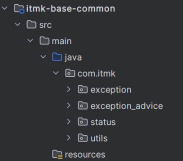
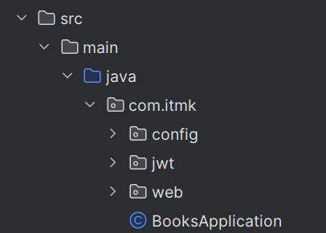
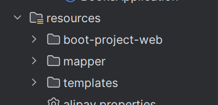
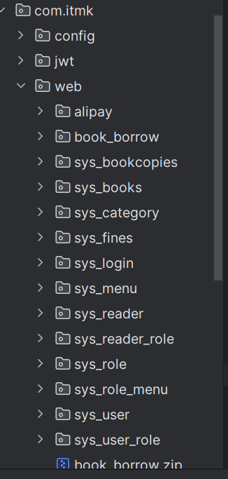
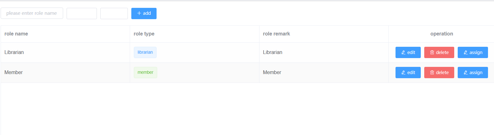
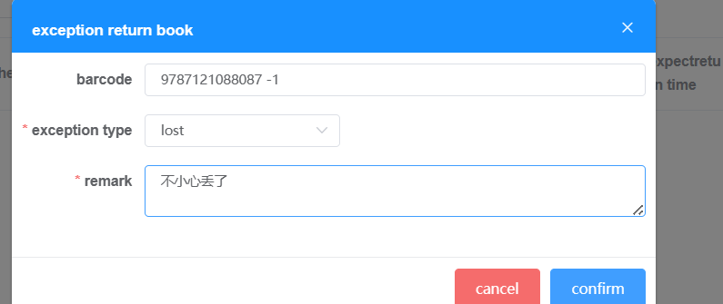

### 摘要
该文档主要为代码的部分说明，以及部分测试报告。
作者：霍新蕊-21009201176
更新日期：2024.6.4

### 基础的代码分块
- 在parent里面总共有common和web两部分
    - common
      一些基础的异常处理
      
      其中有自定义的业务异常拦截状态，也有未知异常运行拦截
```
    //状态码对应的异常情况

    public class StatusCode {
    //返回成功
    public static final int SUCCESS_CODE = 200;
    //错误状态码
    public static final int ERROR_CODE = 500;
    //无权限
    public static final int NO_LOGIN = 600;
    public static final int NO_AUTH = 700;
    }
```
  - web里面主要为后端和前端代码
  
  
  主要实现的功能模块如下：
  
  ### 系统功能测试
  ##### 该系统实现的功能主要有：
  - 系统使用人员的增删改查；
  - 书籍的增删改查；
  - 对书籍的借阅、归还、以及丢失/破损的处罚和交款；
  - 以及对所有模块展示的管理和数据的可视化版面；
  #### 以下为相关对应功能的截图：
  - part 1系统使用人员的增删改查

- part 2 书籍的增删改查；
此处为级联删除


(通过扫描条形码入库和出库)
- 对书籍的借阅、归还、


还书：

以及所有历史信息，包括取消以及其他情况的

- 丢失/破损的处罚和交款

在return这块填写即可

 9787121088087 -1
 
 
 
 
 当然看起来有点混乱，大致过程就是：
 借书->发现书丢了->先还书，然后在还书这里填写未能归还的情况
 
 
 这个时候就去交罚款就好了
 
 
 - 以及对所有模块展示的管理和数据的可视化版面
 
 数据统计：
 